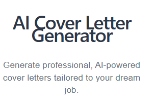

# 🤖 AI Cover Letter Generator

An AI-powered web application that generates professional, ATS-friendly cover letters using the Google Gemini API. Users can enter job details, upload a PDF resume, and receive a personalized cover letter.

## 🚀 Features

- Generate AI-powered cover letters
- Upload and analyze PDF resumes
- Add and remove technical skills
- Copy generated cover letters
- Responsive design for desktop and mobile
- Loading state during AI generation
- Secure API key management using `.env`

## 🛠️ Tech Stack

- React
- Vite
- JavaScript
- Google Gemini API
- PDF.js
- CSS

## 📸 Screenshot

## 📄 AI Usage

AI assistance was used for:
- UI color and layout ideas
- Gemini API integration
- Debugging and resolving development errors

## 👩‍💻 Author

**Dipika Yadav**
